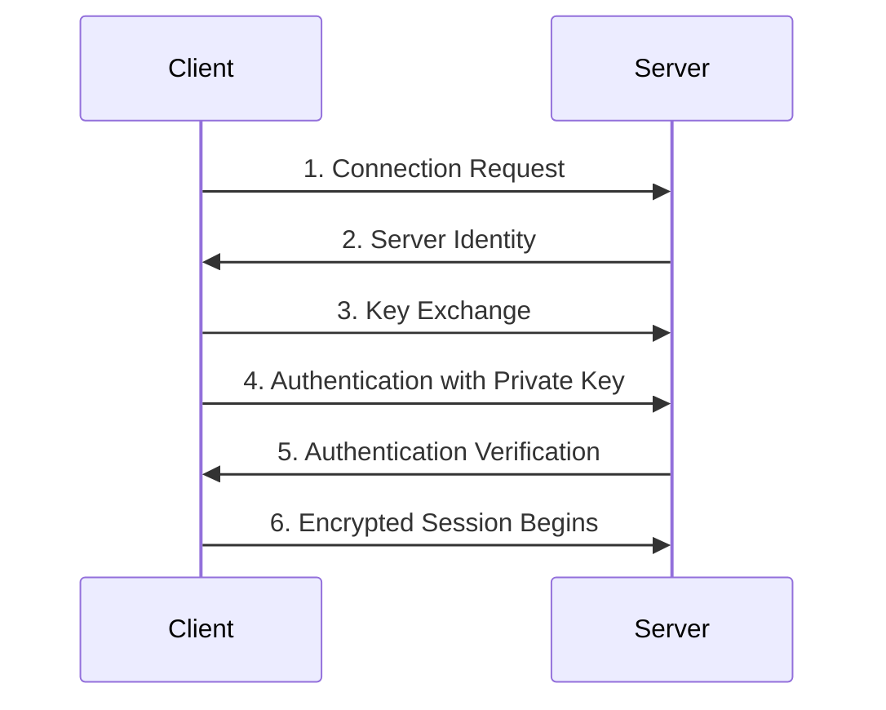
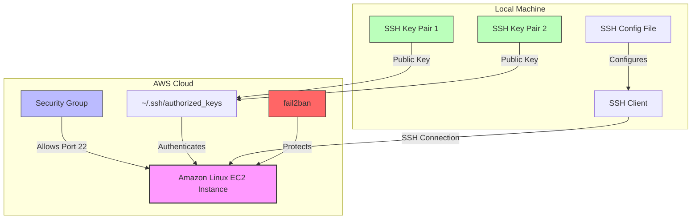
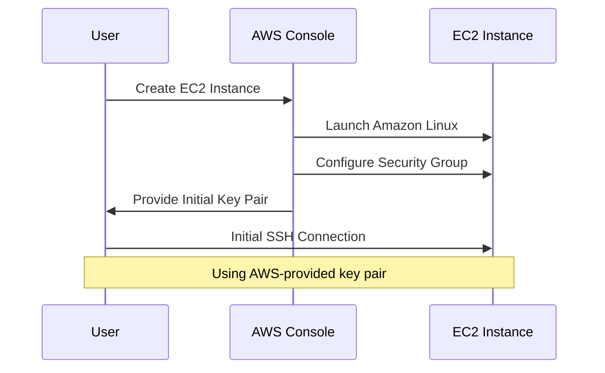
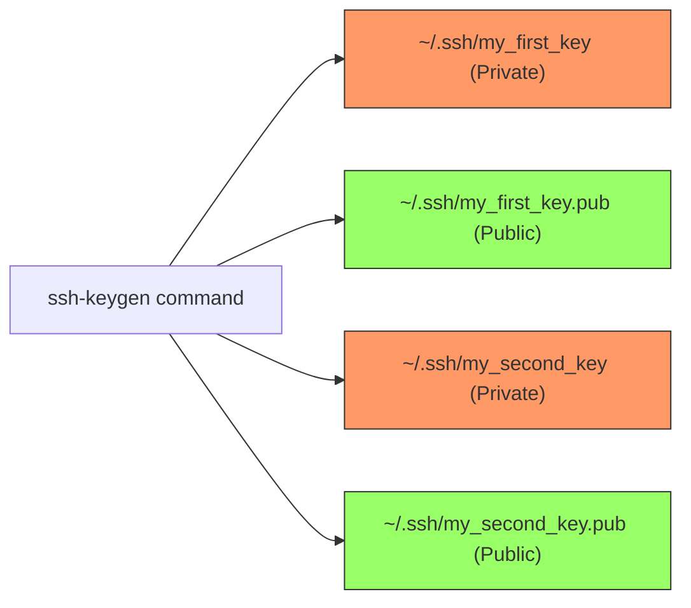
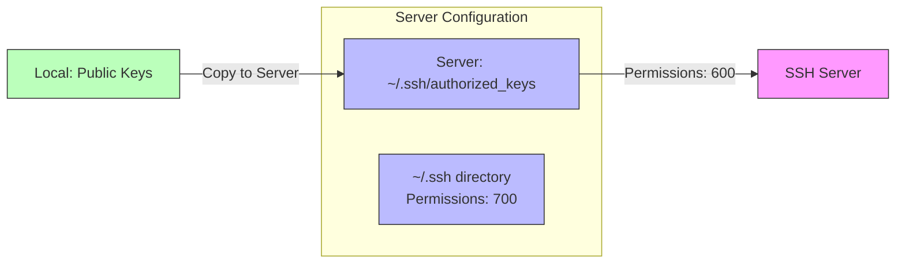
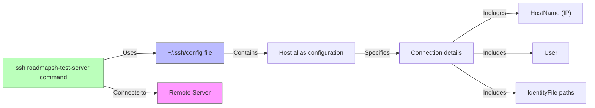
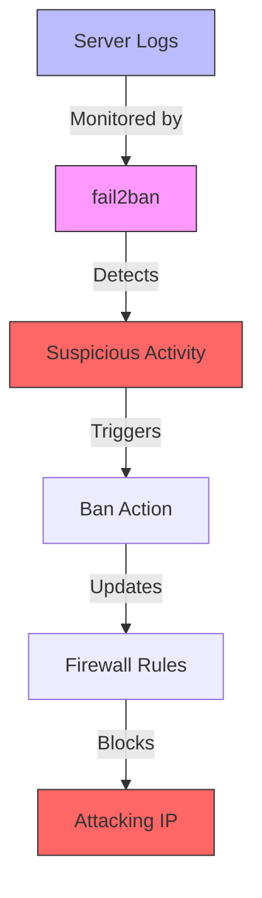
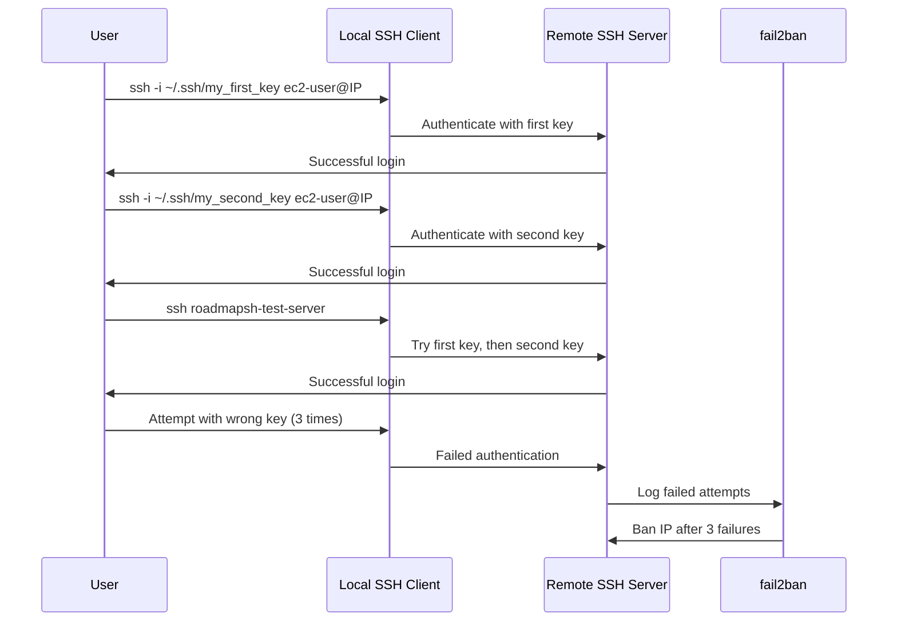

# Secure Remote Server Access: A Complete Guide to SSH Key Management and Server Security

## Introduction

In the world of server administration and cloud computing, secure remote access is of paramount importance. This blog post guides you through the entire process of setting up secure SSH (Secure Shell) access to a remote Linux server on AWS, using multiple SSH key pairs for authentication, and implementing additional security measures like fail2ban to protect against brute force attacks.

By the end of this guide, you'll have a comprehensive understanding of SSH key management, server configuration, and security best practices that you can apply to your own projects.

## Understanding SSH from First Principles

### What is SSH?

SSH (Secure Shell) is a cryptographic network protocol that enables secure communication between two computers over an unsecured network. Unlike its predecessors like Telnet, SSH encrypts all traffic, protecting against eavesdropping and man-in-the-middle attacks.

### The Cryptographic Foundation of SSH

SSH security is built on public-key cryptography. This system uses a pair of keys:

1. **Private Key**: Kept secret on your local machine
2. **Public Key**: Shared with remote servers

These keys work together through asymmetric encryption:
- Messages encrypted with the public key can only be decrypted with the corresponding private key
- The private key is used to generate digital signatures that can be verified with the public key

This creates a secure system where:
- The server knows it's talking to the authorized client (authentication)
- All communication is encrypted (confidentiality)
- Messages cannot be altered in transit (integrity)



## Project Overview: Remote Server Setup with Multiple SSH Keys

Let's implement these concepts by setting up a remote Linux server on AWS with secure SSH access using two separate SSH key pairs. This approach demonstrates how you can manage different authentication credentials for the same server.

### Our Architecture



## Step 1: Provisioning the AWS EC2 Instance

The first step is to create your virtual server in the AWS cloud. EC2 (Elastic Compute Cloud) provides scalable computing capacity in the AWS cloud.



### Step-by-Step EC2 Setup:

1. **Log in to your AWS Console** and navigate to the EC2 dashboard
2. **Launch a new instance** with the following specifications:
   - **AMI**: Amazon Linux (a Linux distribution optimized for AWS)
   - **Instance Type**: t2.micro (free tier eligible)
   - **Security Group**: Create a new one with port 22 (SSH) open
   - **Key Pair**: Create or select an existing key pair for initial access

3. **Connect to your instance** using the AWS-provided key:
   ```bash
   ssh -i ~/.ssh/aws_key.pem ec2-user@your-instance-ip
   ```

> 💡 **Why Amazon Linux?** Amazon Linux is optimized for AWS, includes AWS tools by default, and receives regular security updates directly from Amazon. This makes it an excellent choice for AWS-hosted servers.

## Step 2: Understanding and Generating SSH Key Pairs

SSH key pairs are the cryptographic credentials that allow secure authentication without passwords. Let's generate two separate key pairs for our server:



### Generating SSH Keys from First Principles:

The `ssh-keygen` utility creates a mathematical key pair using public key cryptography algorithms. When generating keys, consider:

1. **Key Type**: RSA is widely supported, but newer algorithms like Ed25519 offer better security with smaller key sizes
2. **Key Size**: For RSA keys, 4096 bits provides strong security
3. **Passphrase**: An optional extra layer of security that encrypts your private key

### Creating Our Keys:

```bash
# Generate first key pair
ssh-keygen -t rsa -b 4096 -f ~/.ssh/my_first_key -C "first-key"

# Generate second key pair
ssh-keygen -t rsa -b 4096 -f ~/.ssh/my_second_key -C "second-key"
```

Each command creates:
- A private key file (`my_first_key` or `my_second_key`)
- A public key file with `.pub` extension

> ⚠️ **Security Alert**: Your private key files should NEVER be shared with anyone or committed to repositories. They should have permissions set to 600 (readable only by your user).

## Step 3: Server-Side SSH Configuration

Now we'll configure our remote server to accept both SSH key pairs for authentication.



### Understanding authorized_keys from First Principles:

The `authorized_keys` file contains a list of public keys that are allowed to authenticate. When an SSH client tries to connect:

1. The server reads `authorized_keys`
2. The client proves it has the corresponding private key
3. If proven, access is granted without a password

### Adding Our Public Keys:

1. **Display your public keys** on your local machine:
   ```bash
   cat ~/.ssh/my_first_key.pub
   cat ~/.ssh/my_second_key.pub
   ```

2. **Add to authorized_keys** on the server:
   ```bash
   # On your remote server
   nano ~/.ssh/authorized_keys
   
   # Paste both public keys, each on its own line
   # Save and exit (Ctrl+X, Y, Enter in nano)
   ```

3. **Set proper permissions**:
   ```bash
   chmod 700 ~/.ssh
   chmod 600 ~/.ssh/authorized_keys
   ```

> 💡 **Why these permissions?** The SSH daemon is highly security-conscious and will refuse to use keys if the permissions are too open. These permission settings ensure only the owner can read or modify the keys.

## Step 4: Configuring Your Local SSH Client

To simplify connections, we'll create an SSH config file that specifies connection details and key locations.



### SSH Config from First Principles:

The SSH config file allows you to:
- Create shortcuts for complex connection commands
- Specify different keys for different servers
- Set server-specific options

### Creating the Config File:

```bash
# On your local machine
nano ~/.ssh/config
```

Add these lines:
```
Host roadmapsh-test-server
    HostName your-instance-ip
    User ec2-user
    IdentityFile ~/.ssh/my_first_key
    IdentityFile ~/.ssh/my_second_key
```

Save and exit. Now you can connect with:
```bash
ssh roadmapsh-test-server
```

SSH will automatically try each key in order until one works.

> 💡 **Pro Tip**: You can include additional options like `ServerAliveInterval 60` to keep connections alive or `Compression yes` to speed up connections over slow networks.

## Step 5: Enhancing Security with fail2ban

fail2ban is a security tool that monitors log files and automatically blocks IP addresses that show malicious signs, such as multiple failed login attempts.



### How fail2ban Works from First Principles:

fail2ban:
1. Constantly monitors log files like `/var/log/secure`
2. Uses regular expressions to detect patterns like failed login attempts
3. Maintains counters for each IP address
4. When thresholds are exceeded, it updates firewall rules to block the IP
5. After a configurable ban time, it removes the block

### Installing and Configuring fail2ban:

1. **Install fail2ban**:
   ```bash
   sudo yum update -y
   sudo yum install fail2ban -y
   ```

2. **Create a custom configuration**:
   ```bash
   sudo cp /etc/fail2ban/jail.conf /etc/fail2ban/jail.local
   sudo nano /etc/fail2ban/jail.local
   ```

3. **Configure the SSH jail** by ensuring these settings:
   ```ini
   [sshd]
   enabled = true
   port = ssh
   filter = sshd
   logpath = /var/log/secure
   maxretry = 3
   bantime = 3600  # 1 hour in seconds
   ```

4. **Start and enable fail2ban**:
   ```bash
   sudo systemctl start fail2ban
   sudo systemctl enable fail2ban
   ```

5. **Verify it's working**:
   ```bash
   sudo fail2ban-client status sshd
   ```

> 💡 **Understanding fail2ban jails**: Each "jail" is a separate configuration for a specific service (like SSH). You can have different settings for different services, allowing fine-grained control over security policies.

## Testing Our Setup

Let's verify that our setup works correctly:



### Test Cases:

1. **Connect with the first key**:
   ```bash
   ssh -i ~/.ssh/my_first_key ec2-user@your-instance-ip
   ```

2. **Connect with the second key**:
   ```bash
   ssh -i ~/.ssh/my_second_key ec2-user@your-instance-ip
   ```

3. **Connect with the alias**:
   ```bash
   ssh roadmapsh-test-server
   ```

4. **Test fail2ban** (optional, and with caution):
   On a different machine, attempt to connect with incorrect credentials multiple times. Then check if your IP is banned:
   ```bash
   sudo fail2ban-client status sshd
   ```

## Security Best Practices

Throughout this tutorial, we've implemented several security best practices. Here's a summary:

### Key Management Best Practices

1. **Use strong keys**: 4096-bit RSA or Ed25519 keys
2. **Protect private keys**: Set permissions to 600 and never share them
3. **Use passphrases**: Add an extra layer of protection to private keys
4. **Rotate keys periodically**: Generate new keys and remove old ones

### Server Configuration Best Practices

1. **Disable password authentication** in `/etc/ssh/sshd_config`:
   ```
   PasswordAuthentication no
   ```
   
2. **Limit user access** by specifying allowed users:
   ```
   AllowUsers ec2-user
   ```
   
3. **Change the default SSH port** to reduce automated attacks:
   ```
   Port 2222  # Example alternative port
   ```

4. **Use security groups/firewalls** to restrict IP ranges that can access SSH

5. **Keep your system updated** with regular security patches:
   ```bash
   sudo yum update -y
   ```

## Conclusion

You've now set up a secure remote server access system using multiple SSH keys and enhanced protection with fail2ban. This approach provides:

1. **Strong authentication** without passwords
2. **Multiple access credentials** that can be managed separately
3. **Protection against brute force attacks**
4. **Simplified connection** through SSH config

This knowledge forms the foundation of secure server administration and can be applied to any Linux-based server, not just AWS EC2 instances.

## Additional Resources

- [OpenSSH Documentation](https://www.openssh.com/manual.html)
- [AWS EC2 User Guide](https://docs.aws.amazon.com/AWSEC2/latest/UserGuide/)
- [fail2ban Documentation](https://www.fail2ban.org/wiki/index.php/Main_Page)
- [SSH Academy](https://www.ssh.com/academy/)
- [Linux Security Best Practices](https://linux-audit.com/linux-server-hardening-most-important-steps-to-secure-your-system/)

---

*Have you set up remote SSH access before? What other security measures do you implement on your servers? Share your experience in the comments below!*
