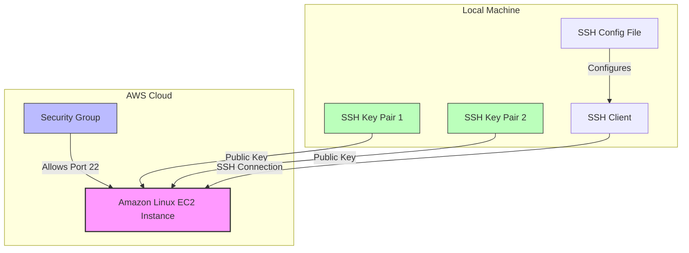
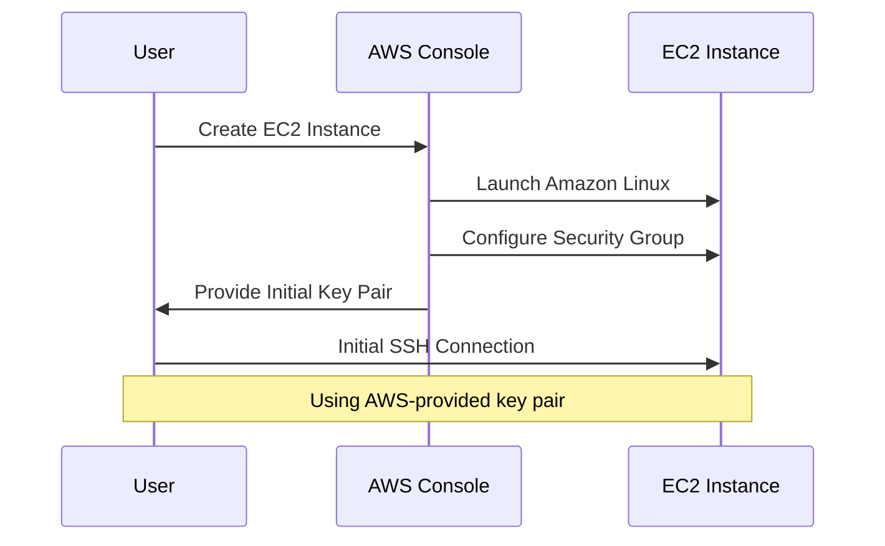
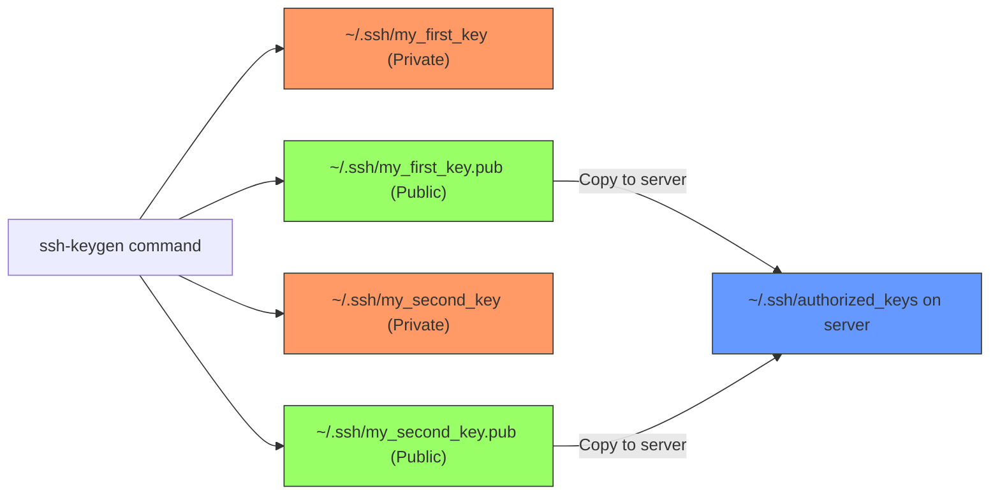
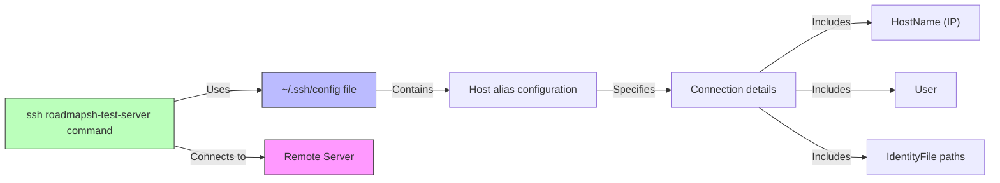
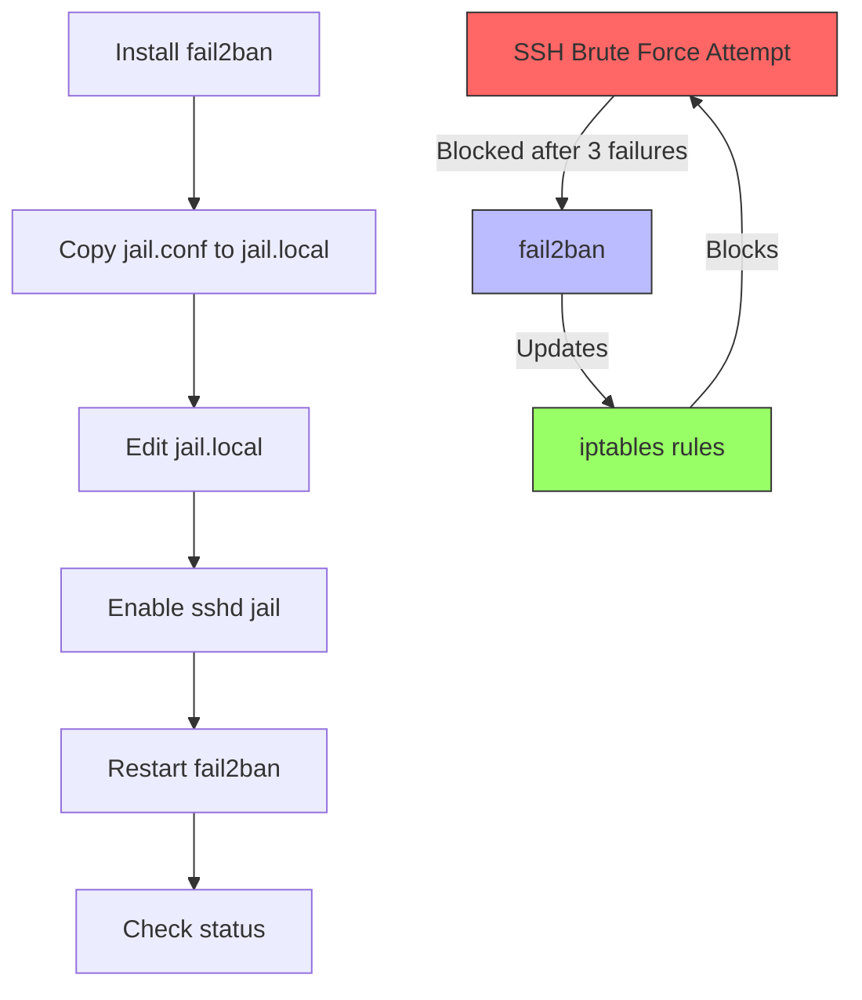
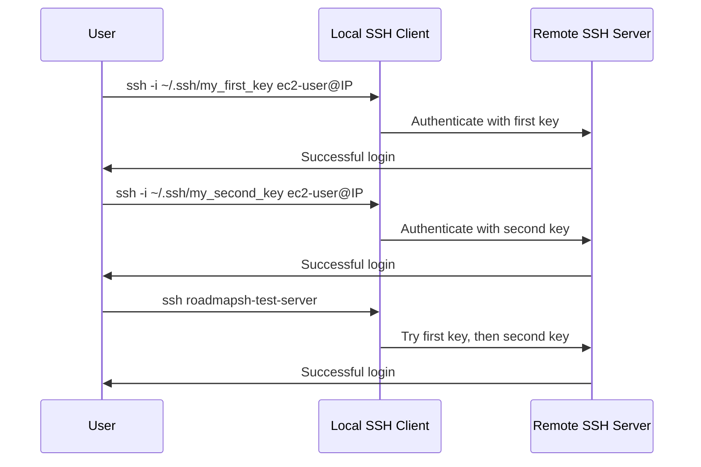

# SSH Remote Server Setup

This project demonstrates how to set up a remote Linux server on AWS (using Amazon Linux), configure SSH access with two distinct SSH key pairs, and secure your server with optional tools such as fail2ban. The goal is to learn and practice basic server provisioning, SSH key management, and security best practices.

**Project Page:** [SSH Remote Server Setup Project](https://roadmap.sh/projects/ssh-remote-server-setup)

## Table of Contents

- [Overview](#overview)
- [Prerequisites](#prerequisites)
- [Project Steps](#project-steps)
  - [1. Provisioning the Server](#1-provisioning-the-server)
  - [2. Generating SSH Key Pairs](#2-generating-ssh-key-pairs)
  - [3. Configuring the Server](#3-configuring-the-server)
  - [4. Configuring the Local SSH Client](#4-configuring-the-local-ssh-client)
  - [5. Securing the Server with fail2ban (Optional)](#5-securing-the-server-with-fail2ban-optional)
- [Testing the Setup](#testing-the-setup)
- [Notes & Best Practices](#notes--best-practices)
- [References](#references)

## Overview

This project walks you through:
- Launching an EC2 instance with Amazon Linux.
- Generating two SSH key pairs and adding their public keys to the server.
- Configuring your local SSH client for simplified access using an alias.
- (Optional) Installing and configuring fail2ban to prevent brute force attacks.

By completing this project, you gain practical experience in secure server administration and remote access configuration.

### Project Architecture



## Prerequisites

- An AWS account.
- Basic knowledge of Linux commands and SSH.
- An SSH client installed on your local machine.
- (Optional) AWS CLI for managing your AWS resources.

## Project Steps

### 1. Provisioning the Server



1. **Launch an EC2 Instance:**
   - **AMI:** Use Amazon Linux.
   - **Instance Type:** Select a t2.micro (free tier eligible).
   - **Security Group:** Open port 22 for SSH access (consider restricting the source IP).
   - **Key Pair for Initial Connection:** Use an AWS-provided key pair for your first login.

2. **Initial Connection:**
   Connect to your instance using your AWS key pair. For example:
   ```bash
   ssh -i ~/.ssh/aws_key.pem ec2-user@34.207.140.198
   ```
   Replace `34.207.140.164` with your instance's public IP address.

### 2. Generating SSH Key Pairs



Generate two new SSH key pairs (separate from the AWS key):

```bash
ssh-keygen -t rsa -b 4096 -f ~/.ssh/my_first_key -C "first-key"
ssh-keygen -t rsa -b 4096 -f ~/.ssh/my_second_key -C "second-key"
```

- **Note:** Keep your private keys secure and never commit them to a public repository.

### 3. Configuring the Server

1. **Add the Public Keys:**
   - Copy the contents of `~/.ssh/my_first_key.pub` and `~/.ssh/my_second_key.pub` from your local machine.
   - On the server, append these to the `~/.ssh/authorized_keys` file:
     ```bash
     nano ~/.ssh/authorized_keys
     ```
     Paste each key on a new line, then save and exit.

2. **Set Correct Permissions:**
   ```bash
   chmod 700 ~/.ssh
   chmod 600 ~/.ssh/authorized_keys
   ```

### 4. Configuring the Local SSH Client



Create or update your `~/.ssh/config` file with an alias for easy access. For example:

```sshconfig
Host roadmapsh-test-server
    HostName 34.207.196.064   # Replace with your instance's public IP
    User ec2-user           # Adjust if your username is different (e.g., ubuntu)
    IdentityFile ~/.ssh/my_first_key
    IdentityFile ~/.ssh/my_second_key
```

Now, you can connect with a simple command:
```bash
ssh roadmapsh-test-server
```

### 5. Securing the Server with fail2ban (Optional)



1. **Update the Server:**
   ```bash
   sudo yum update -y
   ```

2. **Install fail2ban:**
   ```bash
   sudo yum install fail2ban -y
   ```

3. **Configure fail2ban:**
   - Copy the default configuration file:
     ```bash
     sudo cp /etc/fail2ban/jail.conf /etc/fail2ban/jail.local
     ```
   - Edit `/etc/fail2ban/jail.local` to ensure the `[sshd]` section is enabled:
     ```ini
     [sshd]
     enabled = true
     port    = ssh
     filter  = sshd
     logpath = /var/log/secure  # For Amazon Linux
     maxretry = 3
     ```

4. **Restart fail2ban:**
   ```bash
   sudo systemctl restart fail2ban
   ```

5. **Verify Status:**
   ```bash
   sudo fail2ban-client status sshd
   ```

## Testing the Setup



- **SSH Connection:**
  - Test connecting using each key individually:
    ```bash
    ssh -i ~/.ssh/my_first_key ec2-user@34.907.166.164
    ssh -i ~/.ssh/my_second_key ec2-user@34.007.106.164
    ```
  - Use the SSH alias:
    ```bash
    ssh roadmapsh-test-server
    ```

- **Security Verification:**
  - Check fail2ban status to ensure it is protecting against repeated failed login attempts.

## Notes & Best Practices

- **Security:**
  - Never share or commit your private SSH keys.
  - Regularly update your server and review security group settings.
- **Documentation:**
  - This README documents your project setup. Update it if you make any changes.
- **Future Improvements:**
  - Consider adding a firewall (e.g., UFW) or more detailed logging for enhanced security.

## References

- [SSH Remote Server Setup Project on roadmap.sh](https://roadmap.sh/projects/ssh-remote-server-setup)
- [AWS EC2 User Guide](https://docs.aws.amazon.com/AWSEC2/latest/UserGuide/)
- [fail2ban Documentation](https://www.fail2ban.org/wiki/index.php/Main_Page)